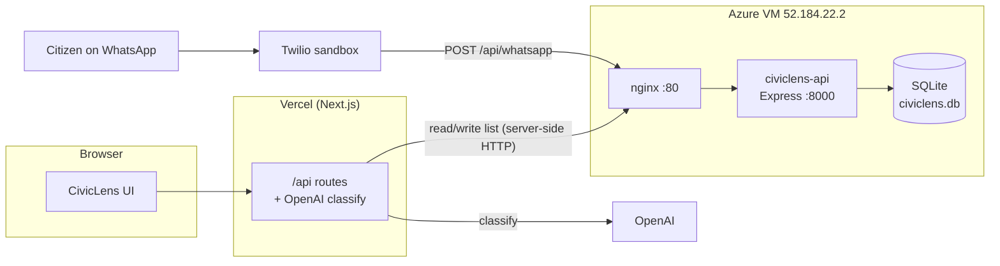

# CivicLens deployment (Vercel + Azure + Twilio)

Live architecture after the hackathon wiring.



**Why classification runs on Vercel, not the VM:** OpenAI rejects API calls from
this Azure region (`403 Country, region, or territory not supported`). So the
Next.js API routes on Vercel do the AI classification (a region OpenAI serves)
and the VM is pure **persistent SQLite** storage. The frontend reaches the VM
server-side (`lib/store.ts` -> `http://52.184.22.2/api/_all`), so the HTTPS page
never makes a mixed-content call. WhatsApp intake currently classifies with the
VM's local heuristic (the webhook lives on the VM).

## What's running on the VM
| Thing | Detail |
|---|---|
| `civiclens-api.service` | `node src/index.js`, Express on `127.0.0.1:8000` |
| `nginx` | proxies `:80` -> `:8000` (unchanged from before) |
| `trench-api.service` | **stopped + disabled** (reversible). See `~/trench/RESTORE-TRENCH.md` |
| code | `~/civiclens` (git clone of this repo), backend in `server/` |
| data | `~/civiclens/server/data/civiclens.db` (SQLite, WAL) |

## Endpoints (VM, public over http://52.184.22.2)
`GET /health` · `GET/PUT /api/_all` (raw list used by Vercel) · `GET/POST /api/complaints` ·
`GET/PATCH /api/complaints/:id` · `POST /api/complaints/:id/upvote` · `GET /api/analytics` ·
`GET/POST /api/whatsapp` (Twilio webhook).

## Environment
**VM** — `~/civiclens/server/.env`:
```
PORT=8000
HOST=127.0.0.1
TWILIO_ACCOUNT_SID=AC...           # for fetching WhatsApp media
TWILIO_AUTH_TOKEN=...              # ditto
# FRONTEND_URL=https://<app>.vercel.app   # adds a Track link to WhatsApp replies
```
**Vercel** — project env vars:
```
OPENAI_API_KEY=sk-...             # REQUIRED for real AI classification (else heuristic)
OPENAI_MODEL=gpt-4o-mini          # or your model
# BACKEND_URL=http://52.184.22.2  # optional; defaults to the VM in production
```

## Common operations
```bash
# ssh in
ssh -i trench-key.pem trench@52.184.22.2

# service
sudo systemctl restart civiclens-api
systemctl status civiclens-api --no-pager
sudo journalctl -u civiclens-api -f          # live logs

# update after a push
cd ~/civiclens && git pull && sudo systemctl restart civiclens-api

# reset demo data to the pristine seed
sudo systemctl stop civiclens-api
rm -f ~/civiclens/server/data/civiclens.db*
sudo systemctl start civiclens-api
```

## Restore Trench
Full steps live on the box at `~/trench/RESTORE-TRENCH.md`. Short version:
```bash
sudo systemctl stop civiclens-api && sudo systemctl disable civiclens-api
sudo systemctl enable trench-api && sudo systemctl start trench-api
```

## WhatsApp intake (Twilio) — finishing setup
The webhook is built, deployed, and tested. Two steps remain, both on your side:

1. **Point the sandbox at the webhook.** Twilio Console -> Messaging -> Try it out
   -> WhatsApp sandbox settings -> **When a message comes in**:
   `http://52.184.22.2/api/whatsapp`  (method **POST**). Save.
2. **Join the sandbox from your phone.** WhatsApp the sandbox number
   **+1 737 221 2163** with the join code Twilio shows (e.g. `join <two-words>`).

Then message the sandbox with any civic issue — you'll get back
`Filed as CL-XXXX. Routed to <dept> ...`. Duplicates reply "joined an existing
issue"; failures reply with a retry note. Photos are pulled in when
`TWILIO_AUTH_TOKEN` is set (it is).

**Trial limitation:** proactive/outbound messages (e.g. pushing a status update
later) need a paid account or an approved template — freeform sends return
`400 trial accounts have limited parameter access`. Inbound + reply works on
trial. To push status updates on resolution, upgrade the Twilio account and wire
`sendWhatsApp()` into `updateComplaint` (see `docs/WHATSAPP-INTEGRATION.md`).

## Verify the Vercel <-> VM data path
On the deployed frontend, file a grievance; then on the VM:
```bash
curl -s http://52.184.22.2/api/_all | python3 -c "import sys,json;print(len(json.load(sys.stdin)))"
```
The count should go up, confirming Vercel classified it and persisted to SQLite.
