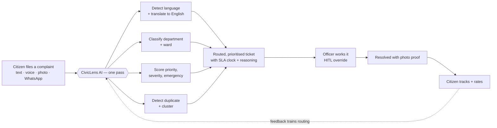
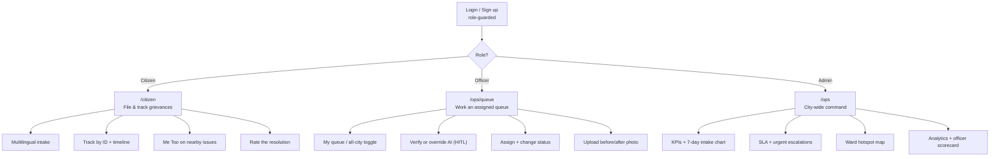
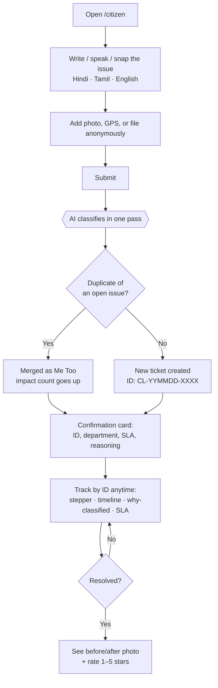
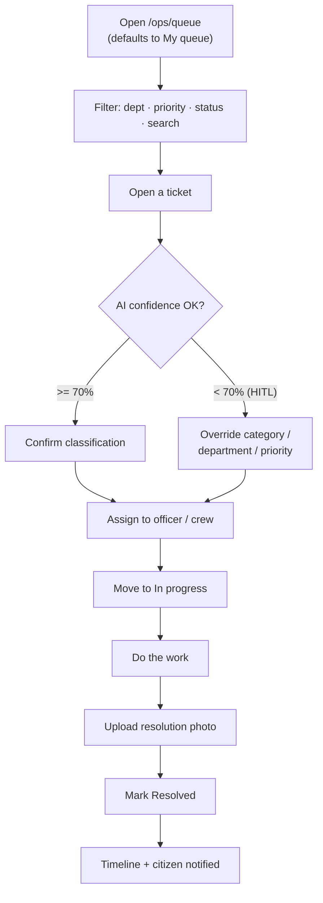
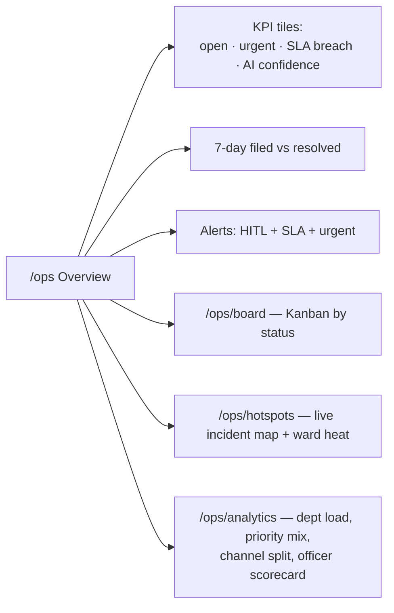
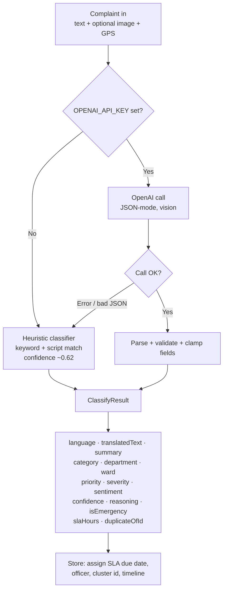
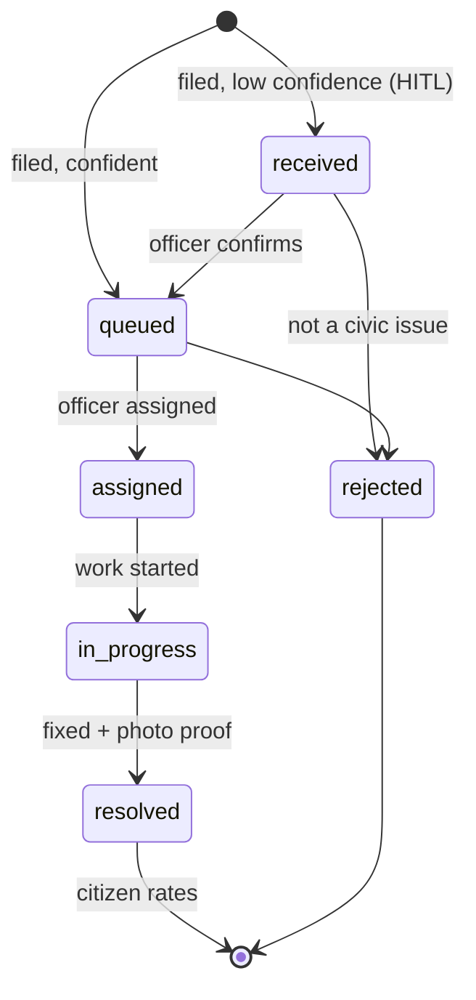
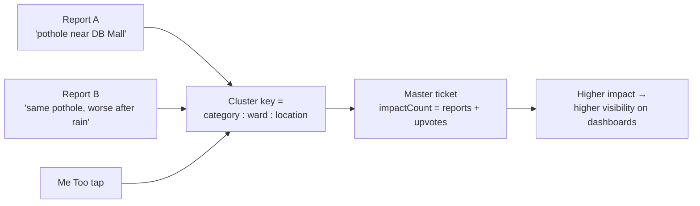
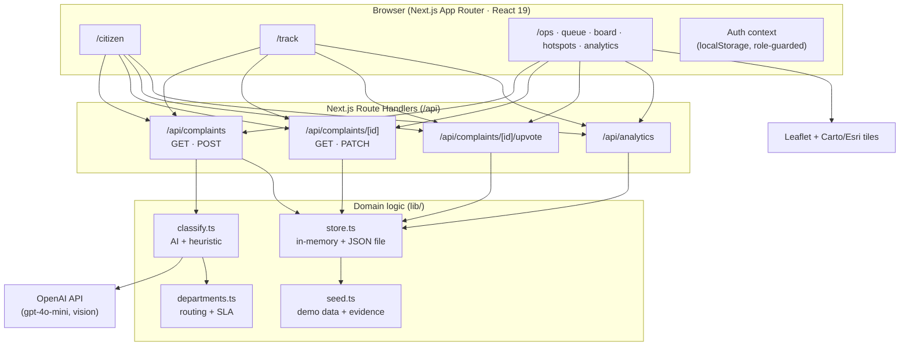

# CivicLens — Product Overview

> **AI grievance intelligence for the city.** One AI pass reads a citizen complaint in any language, classifies it, scores its urgency, routes it to the right department, catches duplicates, and tracks it to resolution — with a full audit trail the citizen can watch.

- **Repo:** https://github.com/ShivamBwaj/smart-grievance-system
- **Live demo:** deployed on Vercel — _add the production URL here_
- **Built for:** VITISH '26 / BGI problem **BT1P1** — Bhopal Municipal Corporation (BMC)
- **Status:** working prototype (demo auth + in-memory store; real OpenAI classification)

> This is the single source of truth for the pitch. Every section below is written to be lifted straight into slides — see the [Slide-by-slide PPT outline](#slide-by-slide-ppt-outline) at the end.

---

## 1. The problem

Municipal grievance redressal in Indian cities is where citizen trust goes to die:

| Pain point | What it looks like today |
|---|---|
| **Language wall** | Complaints come in Hindi, Tamil, English, or mixed — staff triage in English only. |
| **Manual routing** | A human reads every complaint and guesses the department. Slow, inconsistent, error-prone. |
| **Duplicate flood** | One pothole generates 50 tickets. Each is worked separately; nobody sees it's *one* issue affecting many. |
| **No prioritisation** | An open manhole and a faded signboard sit in the same undifferentiated queue. |
| **Zero transparency** | The citizen files into a void — no ID, no status, no ETA, no proof of fix. |
| **No accountability** | No SLA clock, no escalation, no way to see which ward or department is failing. |

**The cost:** dangerous issues wait, citizens stop reporting, and the city flies blind.

---

## 2. The solution

CivicLens puts **one AI pass** at the point of intake and turns a raw complaint into a fully-routed, prioritised, de-duplicated, trackable ticket — instantly.



**The one-line pitch:** _Tell the city what broke — in any language, by text, voice, or photo. CivicLens classifies, scores, routes, and tracks it in one pass, and closes the loop with proof._

---

## 3. Who it's for — three roles, three surfaces



| Role | Lands on | Core job |
|---|---|---|
| **Citizen** | `/citizen` | File a grievance in seconds; track it; back a neighbour's issue with "Me Too"; rate the fix. |
| **Officer** | `/ops/queue` | Work an assigned queue, confirm or override the AI's call, assign, and close with photo proof. |
| **Admin** | `/ops` | Run the whole city — dashboards, escalations, hotspots, department & officer performance. |

---

## 4. User flows

### 4.1 Citizen journey — file → track → close the loop



### 4.2 Officer workflow — triage → act → resolve



### 4.3 Admin command view



---

## 5. How the AI pipeline works

A **single** OpenAI call (`OPENAI_MODEL`, default `gpt-4o-mini`, vision-capable) does everything at intake. If there's no API key or the call fails, a local keyword classifier takes over so intake **never breaks**.



**What the model returns (per complaint):** language + English translation, a one-line summary, department & ward, priority/severity/emergency flag, a **confidence score**, a plain-English **reasoning** an officer can read, and a **duplicate id** if it matches an open ticket.

**Human-in-the-loop (HITL):** confidence `< 0.70` lands the ticket in `received` for an officer to confirm or override before it's worked — the AI assists, humans decide.

---

## 6. Complaint lifecycle (status model)



**SLA clock** starts at intake by priority — urgent `4h`, high `24h`, medium `72h`, low `168h` — and the UI flags **overdue** and **predicted breaches** for escalation.

---

## 7. Duplicate detection & "Me Too" clustering

Instead of 50 tickets for one pothole, CivicLens collapses reports of the *same physical issue* into **one master ticket** with a rising **impact count** — so the city sees scale, and citizens see they're not alone.



---

## 8. System architecture



**Data persistence:** the in-memory cache is the source of truth per instance; a JSON file gives warm-instance persistence. On Vercel (read-only FS) it uses the temp dir and **reseeds on cold start** — perfect for a demo, and the seam where a real database (Postgres/Supabase) would drop in.

---

## 9. Tech stack

| Layer | Choice | Why |
|---|---|---|
| **Framework** | Next.js 16 (App Router) | One codebase for UI + API route handlers; server components; Vercel-native. |
| **Language** | TypeScript 5 | End-to-end typed domain model (`lib/types.ts`). |
| **UI** | React 19 | Latest concurrent React. |
| **Styling** | Tailwind CSS v4 | Custom "Trench" dark ops-console design system in `globals.css`. |
| **Animation** | Framer Motion | Landing reveal, micro-interactions. |
| **Maps** | Leaflet + Carto/Esri tiles | Live incident map & ward hotspots, no paid map SDK. |
| **Charts** | Recharts | Intake trends, department load, priority/channel mix. |
| **Icons** | lucide-react | Consistent line-icon set. |
| **AI** | OpenAI (`gpt-4o-mini`, vision) | Single-pass classify/translate/route; JSON mode. |
| **Auth** | localStorage demo layer | 3 role-guarded personas; swappable for real auth. |
| **Storage** | In-memory + JSON file | Zero-infra demo; clean seam for a real DB. |
| **Deploy** | Vercel | Push-to-`main` auto-deploy. |

**Project map**

```
app/            Next.js routes
  citizen/      Citizen portal (file + track + Me Too)
  track/        Public status lookup by ID
  ops/          Officer + Admin console (queue, board, hotspots, analytics)
  api/          Route handlers (complaints, upvote, analytics)
components/     HUD frame, ticket row/drawer, map panel, landing, charts
lib/            classify · store · departments · seed · types · auth · utils
public/evidence Real photo evidence for the demo tickets
```

---

## 10. Key differentiators (the "why us")

1. **One-pass AI** — classify + translate + route + prioritise + de-dupe in a single call, not a pipeline of services.
2. **Explainable** — every ticket carries a human-readable *reasoning* and a *confidence* score; officers see *why*.
3. **Human-in-the-loop** — low-confidence tickets wait for a human; the AI never silently mis-routes.
4. **Language-native** — Hindi, Tamil, English, or mixed, by text/voice/photo.
5. **Collective signal** — duplicate clustering + "Me Too" surfaces the issues affecting the most people.
6. **Closed loop with proof** — SLA clock, before/after photos, and citizen ratings that feed back into routing.
7. **Graceful degradation** — no API key or a failed call falls back to a local classifier; intake never goes down.

---

## 11. Roadmap (post-prototype)

- Real database (Postgres/Supabase) behind the same `store.ts` interface.
- Real auth (BMC SSO / OTP) replacing the localStorage demo layer.
- Live WhatsApp intake (Cloud API) — the channel is already modelled.
- Push/SMS notifications on status change.
- Officer mobile app for field updates + geo-tagged photo capture.
- Feedback loop that fine-tunes routing from officer overrides + citizen ratings.

---

## Slide-by-slide PPT outline

> Product-centric deck. Each slide lists the headline + the content to drop in. Diagrams above are ready to screenshot or re-draw.

1. **Title** — CivicLens · "AI grievance intelligence for the city" · team names · repo/live links.
2. **The problem** — the 6-row pain table (§1). One stat/visual: "one pothole = 50 tickets."
3. **The solution** — the one-line pitch + the §2 solution flow diagram.
4. **Who it's for** — the 3 roles/surfaces (§3 diagram + table).
5. **Citizen journey** — §4.1 flow. Screenshot: the citizen dashboard + file form.
6. **Officer workflow** — §4.2 flow. Screenshot: queue + ticket drawer (HITL override).
7. **Admin command** — §4.3 flow. Screenshot: overview KPIs + hotspot map.
8. **How the AI works** — §5 pipeline diagram; call out confidence + reasoning + fallback.
9. **Smart de-duplication** — §7 clustering diagram; "impact count" as the hook.
10. **Lifecycle & SLA** — §6 state diagram; urgent = 4h clock, breach escalation.
11. **Architecture** — §8 diagram (keep it high-level for a product audience).
12. **Tech stack** — §9 table (one line each).
13. **Differentiators** — the 7 bullets (§10).
14. **Roadmap** — §11 bullets; "prototype → production" framing.
15. **Demo / thank you** — live link + repo QR + team.

### Suggested screenshots to capture for slides
- Citizen dashboard (KPI tiles + file form + ticket cards with photos)
- Ticket card close-up (shows AI summary + department + SLA + impact count)
- Officer ticket drawer (classification + reasoning + HITL controls + before/after)
- Live incident map with a hotspot open
- Analytics page (charts + officer scorecard)

---

_Diagrams on this page are [Mermaid](https://mermaid.js.org/) and render automatically on GitHub. Edit the fenced ` ```mermaid ` blocks to change them._
