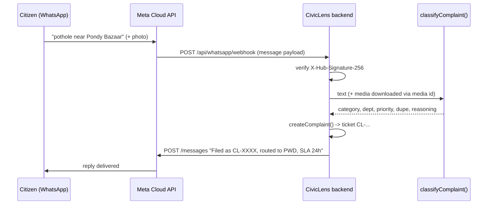

# Making WhatsApp intake real

Today the `whatsapp` channel is modelled in the data but complaints are filed through the web UI. This is exactly how to turn it into real, two-way WhatsApp intake — a citizen messages a number, CivicLens classifies + files it, and replies with a tracking ID.

## Pick a provider

| Option | Pros | Cons | Use when |
|---|---|---|---|
| **Meta WhatsApp Cloud API** (recommended) | Official, free tier (1k conversations/mo), hosted by Meta, no server telephony | Business verification needed for scale; template rules | Production, lowest cost |
| **Twilio WhatsApp** | Fastest to prototype, great docs, sandbox in minutes | Paid per message, extra vendor | Quick demo / hackathon |

Below is the **Meta Cloud API** path (what a real GCC deployment would use).

## One-time setup (Meta)

1. Create a **Meta for Developers** account → **Create App** → type **Business**.
2. Add the **WhatsApp** product. Meta gives you a free **test number** + a temporary token.
3. Note three values → put them in the backend `.env`:
   - `WHATSAPP_PHONE_NUMBER_ID` — the sending number's id
   - `WHATSAPP_TOKEN` — a **permanent** token (generate via a System User in Business Settings; the temp token expires in 24h)
   - `WHATSAPP_VERIFY_TOKEN` — any random string you choose, used for webhook handshake
   - `WHATSAPP_APP_SECRET` — App → Settings → Basic, used to verify request signatures
4. In **WhatsApp → Configuration → Webhook**, set:
   - **Callback URL:** `https://<your-backend>/api/whatsapp/webhook` (must be public HTTPS)
   - **Verify token:** the same `WHATSAPP_VERIFY_TOKEN`
   - **Subscribe** to the `messages` field.

> The callback URL must be HTTPS and public. Our backend (Azure) behind nginx/Caddy with a real cert satisfies this. In dev, use an `ngrok https` tunnel.

## Inbound flow (citizen → CivicLens)



### Webhook verification (GET)
Meta first sends a `GET` with `hub.mode`, `hub.verify_token`, `hub.challenge`. Echo the challenge back if the token matches.

### Message handler (POST) — framework-agnostic sketch
```ts
// verify signature, then:
const msg = body.entry?.[0]?.changes?.[0]?.value?.messages?.[0];
if (!msg) return ok();                       // status callbacks etc.
const from = msg.from;                        // citizen's wa id (phone)
let text = msg.text?.body ?? "";
let imageDataUrl: string | null = null;

if (msg.type === "image") {
  const mediaId = msg.image.id;
  // 1) GET https://graph.facebook.com/v21.0/{mediaId}  -> media URL
  // 2) GET that URL with Bearer WHATSAPP_TOKEN -> bytes -> base64 data URL
  imageDataUrl = await downloadWhatsAppMedia(mediaId);
}

const ai = await classifyComplaint({ text, imageDataUrl, candidates: openTickets });
const ticket = await createComplaint({
  citizenId: `wa-${from}`, citizenName: msg.profileName ?? "WhatsApp user",
  phone: `+${from}`, channel: "whatsapp", originalText: text, imageDataUrl, ...ai,
});

await sendWhatsAppText(from,
  `✅ Filed as ${ticket.id}. Routed to ${ticket.department}. ` +
  `Priority ${ticket.priority}, SLA ${ticket.slaHours}h. Track: https://<frontend>/track?id=${ticket.id}`);
```

### Sending a reply
```ts
await fetch(`https://graph.facebook.com/v21.0/${PHONE_NUMBER_ID}/messages`, {
  method: "POST",
  headers: { Authorization: `Bearer ${WHATSAPP_TOKEN}`, "Content-Type": "application/json" },
  body: JSON.stringify({ messaging_product: "whatsapp", to, type: "text", text: { body } }),
});
```

## Outbound status updates (officer resolves → citizen)

When an officer moves a ticket to `resolved`, push a WhatsApp update. Important rule:

- **Inside 24h** of the citizen's last message → you can send free-form text.
- **Outside 24h** → you must use a **pre-approved message template** (e.g. `grievance_update` with variables for id + status). Submit templates in the WhatsApp Manager and wait for approval.

Hook this into `updateComplaint()` in the backend: after a status change, if the citizen came via `channel === "whatsapp"`, send the template.

## Security checklist
- Verify every webhook with the `X-Hub-Signature-256` HMAC (using `WHATSAPP_APP_SECRET`); reject mismatches.
- Never expose `WHATSAPP_TOKEN` to the frontend — the webhook + send calls run server-side only.
- Rate-limit the webhook; Meta retries on non-200, so return `200` fast and process async.

## What we need to go live
1. A public **HTTPS** backend URL for the webhook (the Azure backend, once TLS + the NSG port are set up — see the deployment plan).
2. Meta app + permanent token + a verified business number (test number works for the demo).
3. `.env` on the backend: `WHATSAPP_TOKEN`, `WHATSAPP_PHONE_NUMBER_ID`, `WHATSAPP_VERIFY_TOKEN`, `WHATSAPP_APP_SECRET`.
4. Add the two routes: `GET/POST /api/whatsapp/webhook`, and a `sendWhatsAppText()` helper wired into `createComplaint` + `updateComplaint`.

For the demo without Meta approval: use the **Twilio WhatsApp sandbox** (join code, instant number) with the same handler shape — swap the send/verify calls for Twilio's.
